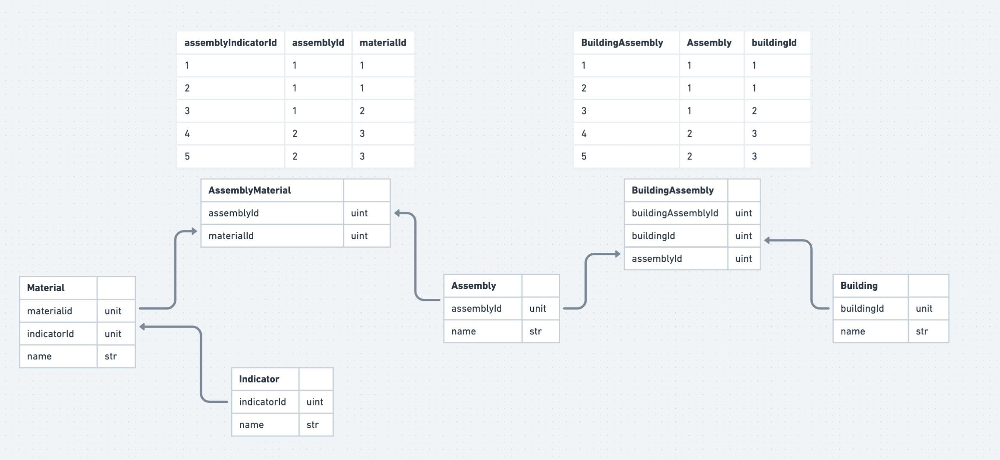

# carbon-service

`carbon-service` is a lightweight API written in Go, designed to facilitate life cycle assessment (LCA) and carbon calculations for the building industry. It provides endpoints for various operations related to building materials, assemblies, and constructions, allowing users to perform carbon footprint calculations and analyze environmental impacts.

## Go for carbon framework

Go as the Language of Choice:

- Leveraging Go's simplicity and concurrency model for efficient and scalable API development.
- Domain-Driven Design: Structuring the codebase around domain objects such as buildings, materials, and assemblies, ensuring a clear representation of real-world concepts.
- Interface Paradigm: Implementing interfaces like `CarbonCalculator` and `EmbodiedCarbonCalculator` allows for maximum flexibility in defining behaviors and calculations specific to carbon impact, while keeping the codebase concise and easily extensible.
- Extensibility and Advanced Functionality: Objects like `Building` can implement multiple interfaces, enabling advanced functionalities like embodied carbon calculation, thus facilitating future enhancements and adaptations in carbon calculation methodologies and data sources.

# Features

- RESTful API: Easily interact with the service using standard HTTP requests.
  -Gorm and PostgreSQL: Utilizes Gorm as an ORM library and PostgreSQL as the database backend.
- Dockerized Environment: Ships with Docker and Docker Compose configurations for easy deployment and development.
- Test Suite: Includes comprehensive test suites to ensure reliability and stability.

## Models

The service includes the following models:

1. Building: Represents a building structure and contains information about its materials and assemblies.
2. Assembly: Represents a collection of materials used in a building.
3. Material: Represents a building material and contains information about its embodied carbon and other properties.
4. Indicator: Represents an environmental indicator and contains information about its name, unit, and value. This will contain kgc02e/m2 values for all LCA stages and other environmental indicators.

Diagram of the models and their relationships:

Image:


# Getting Started

To get started with the Carbon Service, follow these steps:

Prerequisites

1. Go (version 1.22.1 or higher)
2. Docker
3. Docker Compose

## Installation

Clone the repository to your local machine:

```
git clone https://github.com/karim-daw/carbon-service.git
```

Navigate to the project directory:

```
cd carbon-service
```

Build the Docker containers:

```
docker-compose build
```

Start the Docker containers:

```
docker-compose up
```

# Usage

The API will be accessible at http://localhost:80.
Use tools like cURL, Postman, or your preferred HTTP client to interact with the API endpoints.

## Environment Variables

The .env file contains environment variables used by the application. Customize it according to your requirements.

# Tests

Run the test suite using:

```
docker-compose run carbon-service go test ./tests
```

# Contributing

We welcome contributions from the community! If you find any bugs, have feature requests, or want to contribute improvements, please open an issue or submit a pull request.

## License

This project is licensed under the MIT License - see the LICENSE file for details.

Acknowledgments
This project was inspired by the need for sustainable solutions in the building industry.
Special thanks to the contributors who helped make this project possible.
